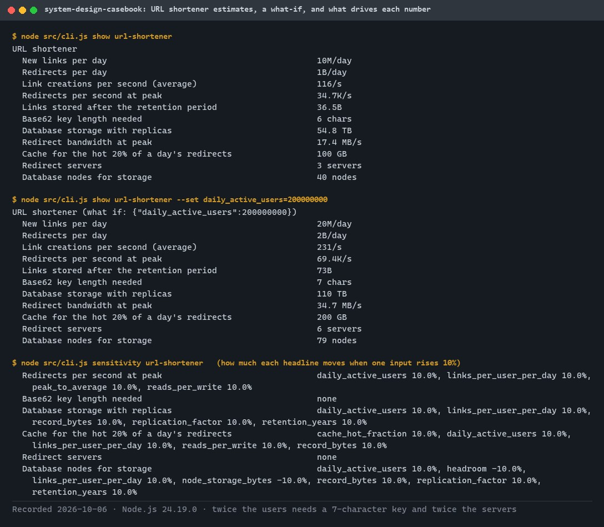
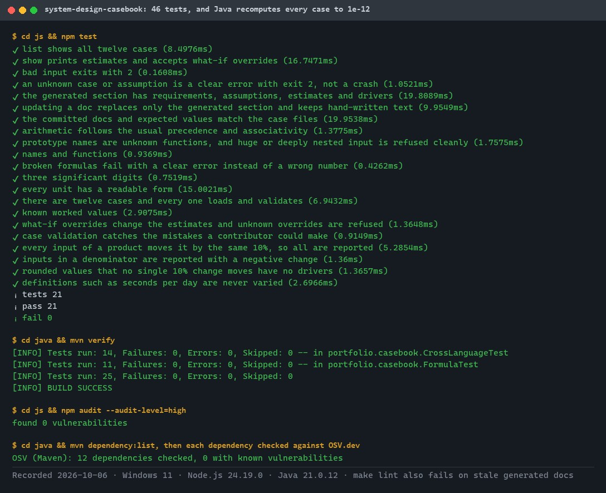
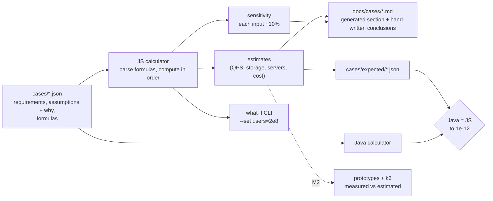
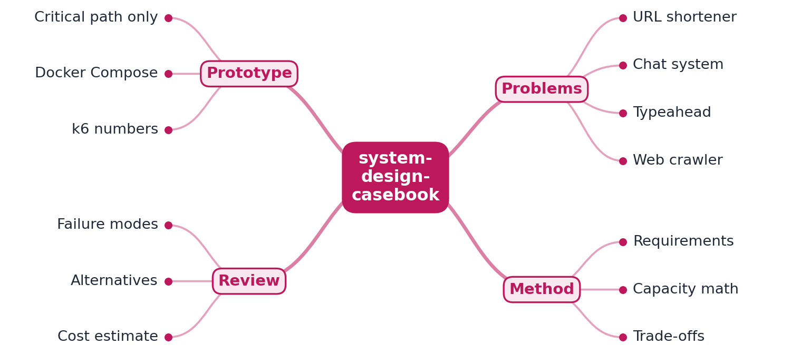
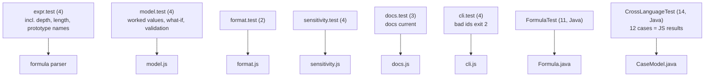

# system-design-casebook

[](https://github.com/EquinoxWN/system-design-casebook/actions/workflows/ci.yml)


> Twelve classic system-design problems turned into numbers: every estimate is computed from stated assumptions, identically in JavaScript and Java, so a what-if is one flag.

Part of my **CS Foundations** list · Java · JS · core project

## Proof it works

Every number in a case is computed from its stated assumptions, so a what-if is one flag. Doubling the URL shortener's users needs a 7-character key, 79 database nodes and 6 redirect servers:



46 tests pass. Java independently recomputes all twelve cases and must match the JavaScript results to 1e-12, and both dependency checks are clean:



## Architecture

**What M1 runs today:**



**Full roadmap (M1 to M3):**



## How it works

_Steps 1 and 2 are built and tested (M1); the rest is on the [roadmap](#roadmap)._

1. Each case starts with functional and non-functional requirements and explicit assumptions: users, QPS, data size.
2. Back-of-envelope math lives in a small calculator, so estimates are reproducible and can be changed live.
3. The design doc proposes an architecture, then compares at least two alternatives and their trade-offs.
4. A minimal prototype implements only the critical path (e.g. ID generation and redirect for the URL shortener), run locally.
5. k6 measures the prototype, and the doc compares measured numbers with the estimate.
6. Every case ends with failure modes, scaling limits and a cost estimate, the way a Staff design review does.

## Tech stack

| Area | In M1 | Planned |
|---|---|---|
| Docs | Markdown case documents generated from the case data | Mermaid sequence and C4 diagrams |
| Numbers | Capacity calculator and CLI in JavaScript, independent recomputation in Java | - |
| Prototypes | - | Java (Spring Boot) and Node.js services with Docker Compose, measured with k6 |

One implementation per language, each in its own folder: [`js/`](js) (the calculator, CLI and doc generator) and [`java/`](java) (an independent recomputation for the M2 Spring Boot prototypes). The cases are data in [`cases/`](cases); their documents are in [`docs/cases/`](docs/cases).

## Run it

**Prerequisites:** JDK 21+ with Maven, and Node.js 24+.

```bash
make setup   # npm ci
make lint    # javac -Werror, tsc --checkJs --strict, docs and expected values current
make test    # 21 JavaScript tests, then 25 Java tests that recompute every case
make docs    # after editing a case file: regenerate docs and expected values
```

Explore a case and ask "what if":

```bash
cd js
node src/cli.js list
node src/cli.js show url-shortener
node src/cli.js show url-shortener --set daily_active_users=200000000   # key length goes from 6 to 7
node src/cli.js sensitivity chat
```

### The twelve cases

| Case | What the numbers say sizes the system |
|---|---|
| [URL shortener](docs/cases/url-shortener.md) | 34.7K redirects/s need only 3 servers; 54.8 TB over ten years needs 40 database nodes; a 6-character key has 1.6x headroom |
| [Pastebin](docs/cases/pastebin.md) | 174 reads/s on one server; 110 TB of bodies belongs in object storage |
| [Distributed rate limiter](docs/cases/rate-limiter.md) | 174K checks/s need 3 counter-store shards; counters fit in 4 GB |
| [News feed](docs/cases/news-feed.md) | pushing every post costs 1.39M feed inserts/s against 69.4K reads/s; a celebrity post takes 100 s to fan out |
| [Chat](docs/cases/chat.md) | 100M connections need 1,429 gateways; the messages are only 278 MB/s |
| [Notifications](docs/cases/notifications.md) | 25 workers handle the traffic, but SMS costs $375K a day |
| [Web crawler](docs/cases/web-crawler.md) | 386 pages/s means 579 fetches in flight (Little's law), spread across hosts |
| [Search typeahead](docs/cases/typeahead.md) | 347K requests/s from keystrokes; the 100 GB index fits in memory |
| [Ride hailing](docs/cases/ride-hailing.md) | 250K location updates/s into a 300 MB live index |
| [Video streaming](docs/cases/video-streaming.md) | 111 Tbps at peak only works through a CDN; 120K transcoding cores |
| [File sync](docs/cases/file-sync.md) | 1.05 EB physical; erasure coding halves the disks; metadata is the bottleneck |
| [Metrics monitoring](docs/cases/metrics-monitoring.md) | memory for 100M series (18 ingesters), not sample volume, is the limit |

Every assumption carries a reason, every estimate shows its formula, and the sensitivity table lists which assumptions move each headline number.

## Tests and results

Full numbers and commands: [docs/results/m1.md](docs/results/m1.md).

| Check | Result |
|---|---|
| Tests (`make test`) | **46 passed** (JavaScript 21, Java 25), 0 failed |
| Cross-language | all twelve cases: every Java estimate equals the JavaScript one to 1e-12 |
| Docs current | `make lint` fails if a case changed without regenerating its doc and expected values |
| Formula safety | eleven malicious or broken formulas rejected with clear errors, in both languages |
| Lint / audit | javac `-Werror` and strict `tsc` clean; `npm audit`: 0 vulnerabilities |

### Test map



## Roadmap

**M1** (≈15 h)
- [x] Write `docs/rfc/0001-design.md`: problem, goals, non-goals, chosen design
- [x] Each case starts with functional and non-functional requirements and explicit assumptions: users, QPS, data size.
- [x] Back-of-envelope math lives in a small calculator, so estimates are reproducible and can be changed live.

**M2** (≈20 h)
- [ ] The design doc proposes an architecture, then compares at least two alternatives and their trade-offs.
- [ ] A minimal prototype implements only the critical path (e.g. ID generation and redirect for the URL shortener), run locally.

**M3** (≈25 h)
- [ ] k6 measures the prototype, and the doc compares measured numbers with the estimate.
- [ ] Every case ends with failure modes, scaling limits and a cost estimate, the way a Staff design review does.
- [ ] Publish the proof below with real numbers

## Proof

What this repo must show before it counts as done:

- Twelve design docs whose estimates are checked against measured prototype numbers.

| Result | Value |
|---|---|
| M3 proof above | Not measured yet (M3). Current M1 numbers: see [Tests and results](#tests-and-results). |

## Why it matters

- **Interview angle:** The system design round itself: rehearsal material backed by working prototypes.
- **Upstream I'd like to contribute to:** donnemartin/system-design-primer: contribute a reviewed case study or corrections.

## Design docs

- [RFC 0001: design](docs/rfc/0001-design.md)
- [ADR 0001: record architecture decisions](docs/adr/0001-record-architecture-decisions.md)
- [ADR 0002: cases as data with a parsed formula language](docs/adr/0002-cases-as-data-with-a-parsed-formula-language.md)
- [ADR 0003: report every tied driver](docs/adr/0003-report-every-tied-driver.md)
- [M1 results](docs/results/m1.md)

## Scope

This is a learning and portfolio system, not a hosted production service. Everything runs locally.

## Security and contributing

- Every GitHub Action is pinned to a commit SHA; workflows run read-only, without persisted credentials.
- Dependabot proposes dependency and action updates weekly.
- Formulas from case files are parsed by a small grammar and never evaluated as code; CI runs `npm audit` on every push (Java dependencies: Dependabot alerts).
- Report vulnerabilities privately: see [SECURITY.md](SECURITY.md). To contribute, see [CONTRIBUTING.md](CONTRIBUTING.md).

## License

MIT, see [LICENSE](LICENSE).
